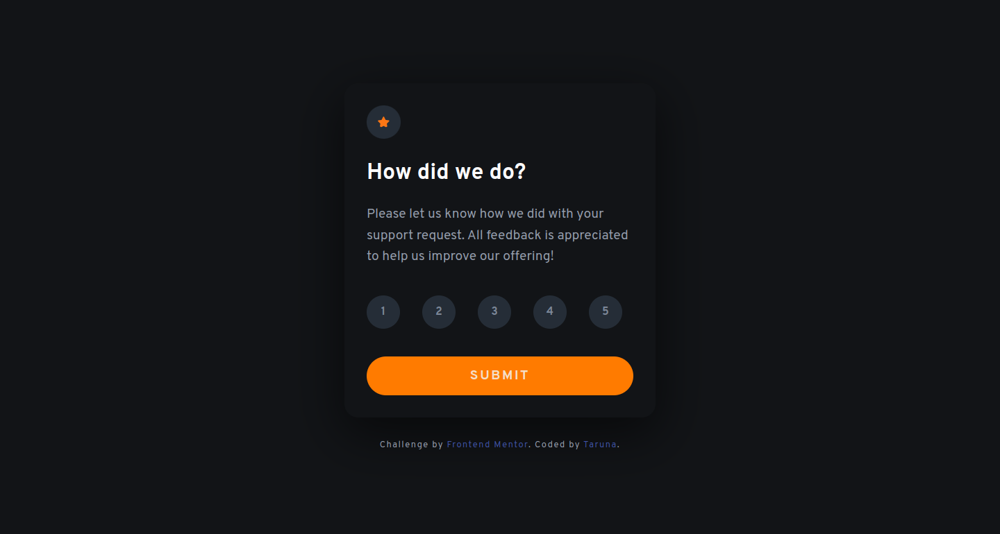
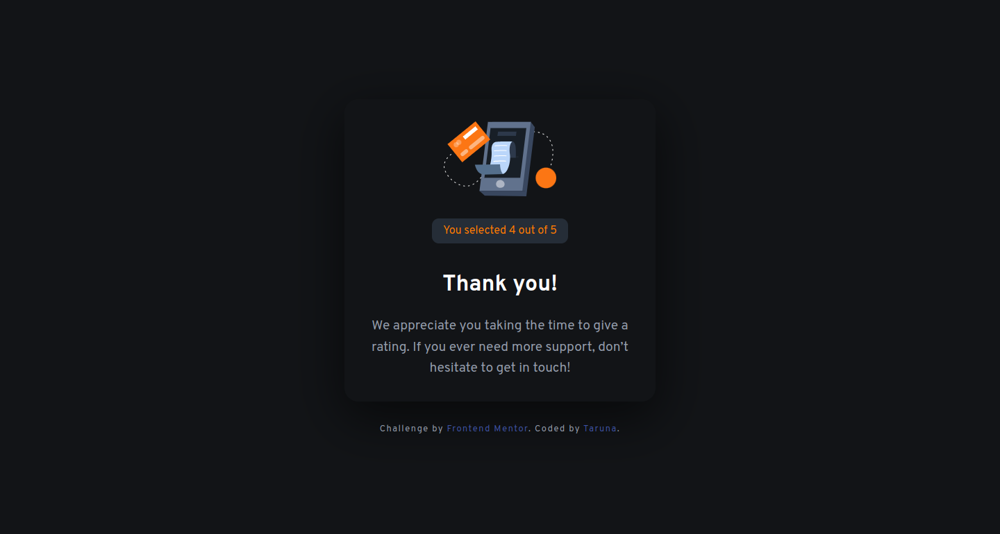
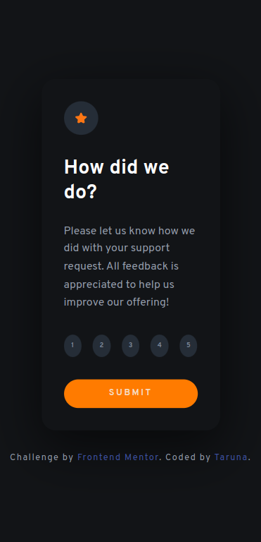

# Frontend Mentor - Interactive rating component solution

This is a solution to the [Interactive rating component challenge on Frontend Mentor](https://www.frontendmentor.io/challenges/interactive-rating-component-koxpeBUmI). Frontend Mentor challenges help you improve your coding skills by building realistic projects.

## Table of contents

- [Overview](#overview)
  - [The challenge](#the-challenge)
  - [Screenshot](#screenshot)
  - [Links](#links)
- [My process](#my-process)
  - [Built with](#built-with)
  - [What I learned](#what-i-learned)
  - [Continued development](#continued-development)
  - [Useful resources](#useful-resources)
- [Author](#author)

## Overview

### The challenge

Users should be able to:

- View the optimal layout for the app depending on their device's screen size
- See hover states for all interactive elements on the page
- Select and submit a number rating
- See the "Thank you" card state after submitting a rating

### Screenshot







### Links

- Solution URL: [Solution URL here](https://github.com/Tiyana19/interactive-rating-component)
- Live Site URL: [Live site URL here](https://tiyana19.github.io/interactive-rating-component/)

## My process

### Built with

- Semantic HTML5 markup
- CSS custom properties
- Flexbox
- Document Object Model - JavaScript

### What I learned

```
  let activeElement = document.getElementsByClassName("active")[0];
  ratingNumber.innerText = activeElement.innerText;

```

```

for (let i = 0; i < ratings.length; i++) {
  const rate = ratings[i];
  rate.addEventListener("click", ratingFunc);
}

function ratingFunc(e) {
  for (let j = 0; j < ratings.length; j++) {
    const rate = ratings[j];
    rate.classList.remove("active");
  }
  e.target.classList.add("active");
}

```

### Continued development

- Event Listener
- This keyword
- DOM

### Useful resources

- Add a class to one and only one element from an HTML list on click - (https://stackoverflow.com/questions/62558082/add-a-class-to-one-and-only-one-element-from-an-html-list-on-click)

- JavaScript click event listener on class -v (https://stackoverflow.com/questions/19655189/javascript-click-event-listener-on-class)

## Author

- Frontend Mentor - [@Tiyana19](https://www.frontendmentor.io/profile/Tiyana19)
